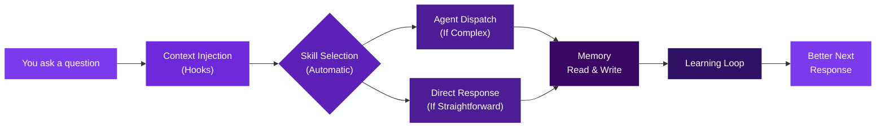
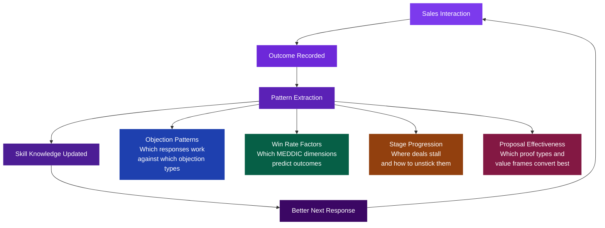

<div align="center">


# Sales Enablement Plugin

### What if your AI assistant remembered every deal, learned from every objection, and got smarter with every call?

*A complete AI operating system for B2B sales teams — built as a Claude Code plugin.*

[The Vision](#the-vision) · [How It Works](#how-it-works) · [The 5 Skills](#-the-5-skills) · [The 3 Agents](#-the-3-agents) · [The 5 Commands](#-the-5-commands) · [Self-Learning](#-self-learning-system) · [Why This Matters](#-why-this-matters)

</div>

---

## The Vision

Most sales tools are databases pretending to be intelligence. They store information but never learn. They track activities but never advise. They generate reports but never challenge your assumptions.

**This plugin is different.** It is a fully autonomous AI sales operations system that:

- **Remembers** every company, contact, deal, win, and loss across sessions
- **Learns** which objection responses work, which deal patterns predict wins, and which proposals convert
- **Challenges** optimistic forecasts with data-driven risk analysis
- **Prepares** you for every call with research, stakeholder maps, and tailored questions
- **Improves** its own recommendations based on outcomes — not just inputs

It is not a chatbot with sales tips. It is a structured operating system for managing a complex B2B pipeline, built on five proven sales frameworks and designed to compound intelligence over time.

---

## What Is a Claude Code Plugin?

> **For non-technical readers:** Claude Code is Anthropic's command-line AI assistant. A *plugin* extends what it can do — like installing an app on your phone. This plugin gives Claude deep expertise in sales operations. When you talk about deals, objections, competitors, or proposals, the plugin automatically activates the right capabilities, loads relevant deal history, and produces structured outputs using proven sales methodologies. No setup, no prompting tricks — just talk about your work and the system responds with the right tools.

---

## How It Works

Every interaction flows through a system designed to surface the right context, select the right capability, and feed outcomes back into memory.



**In plain language:** When you start a session, the plugin automatically loads your pipeline status. When you mention a company or contact, it pulls their full history. When you ask a question, it selects the right skill — deal analysis, objection handling, competitive intel, proposal writing, or call prep. For complex situations, it dispatches a specialized AI agent. Every interaction writes back to memory, so the system gets smarter over time.

---

## Component Architecture

```mermaid
graph TD
    Plugin["Sales Enablement Plugin"]

    Plugin --> Skills["Skills (5)\nAuto-invoked capabilities"]
    Plugin --> Agents["Agents (3)\nDeep work specialists"]
    Plugin --> Commands["Commands (5)\nUser-triggered workflows"]
    Plugin --> Hooks["Hooks (2)\nAutomatic context management"]
    Plugin --> Frameworks["Frameworks (5)\nSales methodologies"]
    Plugin --> Templates["Templates (5)\nStructured outputs"]
    Plugin --> Playbooks["Playbooks (6)\nProven response patterns"]
    Plugin --> Memory["Memory\nAdaptive knowledge base"]

    Skills --> S1["Deal Analysis"]
    Skills --> S2["Objection Handling"]
    Skills --> S3["Competitor Intel"]
    Skills --> S4["Proposal Craft"]
    Skills --> S5["Call Prep"]

    Agents --> A1["Deal Strategist\n(Opus)"]
    Agents --> A2["Proposal Reviewer\n(Sonnet)"]
    Agents --> A3["Pipeline Analyst\n(Sonnet)"]

    Memory --> M1["Companies"]
    Memory --> M2["Contacts"]
    Memory --> M3["Deals"]
    Memory --> M4["Wins & Losses"]
    Memory --> M5["Learnings"]

    style Plugin fill:#7C3AED,color:#fff,stroke:none
    style Skills fill:#2563EB,color:#fff,stroke:none
    style Agents fill:#059669,color:#fff,stroke:none
    style Commands fill:#D97706,color:#fff,stroke:none
    style Hooks fill:#DC2626,color:#fff,stroke:none
    style Frameworks fill:#7C3AED,color:#fff,stroke:none
    style Templates fill:#DB2777,color:#fff,stroke:none
    style Playbooks fill:#9333EA,color:#fff,stroke:none
    style Memory fill:#1D4ED8,color:#fff,stroke:none
```



---

## The 5 Skills

Skills are the plugin's core intelligence layer. They activate **automatically** based on what you say — no commands needed. Ask about a deal and the deal analysis skill fires. Mention a competitor and competitive intel loads. The plugin reads your intent and responds with the right methodology.

---

<table>
<tr>
<td width="80" align="center">

### :dart:

</td>
<td>

### Deal Analysis

**Triggers on:** "analyze this deal", "MEDDIC score", "is this deal real?", "deal risk", "should I forecast this?"

**What it does:** Scores deals against the MEDDIC framework, validates stage-gate criteria, calculates weighted risk scores, identifies stall indicators, and generates a Deal Health Card with prioritized next actions.

**What it produces:** A structured assessment that tells you whether a deal is real, where the gaps are, and exactly what to do next — grounded in methodology, not gut feeling.

</td>
</tr>
</table>

---

<table>
<tr>
<td width="80" align="center">

### :shield:

</td>
<td>

### Objection Handling

**Triggers on:** "they said it's too expensive", "how do I respond to...", "they're stalling", "they want to wait", "pushback"

**What it does:** Classifies the objection type (price, timeline, competition, authority, need, risk), retrieves proven response patterns from the playbook library, and adapts them to your specific deal context using the AIRC framework (Acknowledge, Isolate, Respond, Confirm).

**What it produces:** 2-3 tailored responses ranked by situation fit, with talk tracks you can use verbatim or adapt. Learns which patterns work over time.

</td>
</tr>
</table>

---

<table>
<tr>
<td width="80" align="center">

### :crossed_swords:

</td>
<td>

### Competitor Intel

**Triggers on:** "battle card", "how do we compare to...", "they're also looking at [competitor]", "SWOT", "trap questions"

**What it does:** Builds and maintains competitive battle cards with positioning, pricing intelligence, win/loss patterns, trap questions that expose competitor weaknesses, and landmine detection for questions competitors will plant about you.

**What it produces:** A battle card you can bring into any competitive deal — with specific talk tracks for displacing the competitor and defending against their likely attacks.

</td>
</tr>
</table>

---

<table>
<tr>
<td width="80" align="center">

### :page_facing_up:

</td>
<td>

### Proposal Craft

**Triggers on:** "write a proposal", "executive summary", "ROI calculation", "business case", "how should I price this?"

**What it does:** Generates SCRAP-structured proposals (Situation, Complication, Resolution, Action, Proof) with value quantification (ROI, payback period, cost of inaction), selects relevant case studies, and dispatches the Proposal Reviewer agent for a 10-point quality gate before you send anything.

**What it produces:** A client-ready proposal document that reads like it was written by a strategic partner, not a vendor — reviewed against quality standards before it leaves your hands.

</td>
</tr>
</table>

---

<table>
<tr>
<td width="80" align="center">

### :phone:

</td>
<td>

### Call Prep

**Triggers on:** "prep for my call with...", "meeting with [company]", "what should I ask?", "discovery questions", "demo prep"

**What it does:** Researches the company and contact, builds a stakeholder map, generates tailored discovery questions using the SPIN framework (Situation, Problem, Implication, Need-Payoff), designs a meeting agenda, and crafts a close question appropriate to the meeting type.

**What it produces:** A one-page call briefing that turns 30 minutes of prep into 2 minutes — with every question, talking point, and trap pre-loaded.

</td>
</tr>
</table>

---

## The 3 Agents

Agents are specialized AI personas dispatched for complex work that requires deep reasoning. Each agent has a distinct expertise, communication style, and analytical approach — they don't just answer differently, they *think* differently.

---

<table>
<tr>
<td width="80" align="center">

### :brain:

</td>
<td>

### Deal Strategist

**Model:** Opus (highest reasoning capability)

**Dispatched when:** Multi-stakeholder deals, competitive displacement, deals over $200K, stalled opportunities, creative deal structuring, strategic negotiation challenges.

**Persona:** A senior sales strategist with 20+ years closing complex B2B deals and $500M+ in career revenue. Thinks in power maps, not org charts. Sees the political landscape behind every deal.

**What it produces:** Strategic playbooks for navigating complex deal dynamics — stakeholder influence maps, negotiation sequencing, creative structuring options, and the uncomfortable truths about why a deal is really stuck.

</td>
</tr>
</table>

---

<table>
<tr>
<td width="80" align="center">

### :mag:

</td>
<td>

### Proposal Reviewer

**Model:** Sonnet (fast, thorough analysis)

**Dispatched when:** Any proposal, SOW, executive summary, or client-facing document needs review before sending. Automatically invoked by the `/proposal` command.

**Persona:** An expert proposal editor who has reviewed 1,000+ B2B proposals and has worked both sides — as a sales leader who sent proposals and a procurement executive who received them. Knows what makes buyers say "yes, let's move forward" vs. "let me think about it."

**What it produces:** A 10-point quality gate review covering clarity, buyer empathy, value proof, competitive differentiation, pricing presentation, risk mitigation, call-to-action strength, and more. Every proposal gets better before it ships.

</td>
</tr>
</table>

---

<table>
<tr>
<td width="80" align="center">

### :bar_chart:

</td>
<td>

### Pipeline Analyst

**Model:** Sonnet (fast, data-driven)

**Dispatched when:** Pipeline reviews, forecasting, deal velocity analysis, conversion rate assessment, risk identification across the full pipeline.

**Persona:** A data-driven sales operations analyst with 12 years of B2B analytics experience. Built forecasting models for teams ranging from 5 to 500 reps. Believes the pipeline never lies, but reps often do (unintentionally).

**What it produces:** Pipeline health dashboards, weighted forecast models, velocity metrics, at-risk deal identification, and prioritized recommendations — the analysis a world-class RevOps team would deliver, on demand.

</td>
</tr>
</table>

---

## The 5 Commands

Commands are explicit workflows you trigger with a slash. Each one orchestrates multiple skills, loads relevant memory, and produces structured output.

| Command | Usage | What It Does |
|---|---|---|
| :dart: **`/analyze-deal`** | `/analyze-deal meridian-media` | Runs MEDDIC scoring, validates stage-gate criteria, calculates weighted risk, and outputs a Deal Health Card with prioritized next actions |
| :phone: **`/prep-call`** | `/prep-call meridian-media "Marcus Lee" discovery` | Generates a call briefing with company research, stakeholder map, tailored discovery questions, value propositions, and a meeting-type-appropriate close question |
| :crossed_swords: **`/battle-card`** | `/battle-card tradedesk` | Produces a competitive battle card with positioning, trap questions, landmine detection, pricing intel, and reference suggestions |
| :page_facing_up: **`/proposal`** | `/proposal meridian-media 350000 new-business` | Generates a SCRAP-structured proposal with ROI quantification, case study selection, and automatic quality gate review via the Proposal Reviewer agent |
| :bar_chart: **`/pipeline`** | `/pipeline review` | Reads all active deals, calculates weighted pipeline value, identifies at-risk deals, and generates prioritized recommendations. Also supports `forecast`, `risk`, and `velocity` |

---

## Self-Learning System

This is not a static tool. Every interaction feeds a learning loop that makes the system's recommendations increasingly calibrated to your specific pipeline, buyer patterns, and market dynamics.



### What the system learns over time:

| Learning Category | What It Tracks | How It Improves Responses |
|---|---|---|
| **Objection Patterns** | Which response frameworks work best against each objection type | Ranks future responses by historical effectiveness |
| **Win Rate Factors** | Which MEDDIC dimensions most predict deal outcomes | Weights risk scores toward the factors that actually matter |
| **Stage Progression** | How quickly deals move between stages and where they stall | Flags deals that deviate from healthy patterns |
| **Proposal Effectiveness** | Which proof types, pricing structures, and value frames convert | Selects the highest-converting elements for future proposals |

---

## Memory Architecture

The plugin maintains a persistent knowledge base stored as structured markdown files. Every company, contact, deal, win, loss, and learning persists across sessions — so the AI never starts from zero.

```
data/memory/
├── companies/          → Company profiles, org charts, relationship history
│   ├── meridian-media.md
│   ├── brightpath-health.md
│   └── velocity-sports.md
├── contacts/           → Individual stakeholder records, preferences, influence maps
│   ├── marcus-lee.md
│   ├── rachel-torres.md
│   └── kevin-oconnell.md
├── deals/              → Active deal files with MEDDIC scores, stage history, risk flags
│   ├── meridian-media.md
│   └── brightpath-health.md
├── wins/               → Won deal post-mortems — what worked and why
├── losses/             → Lost deal autopsies — what broke and what to do differently
└── learnings/          → Self-accumulating pattern intelligence
    ├── objection-patterns.md
    ├── win-rate-factors.md
    ├── stage-progression.md
    └── proposal-effectiveness.md
```

**The system ships with real sample data** — 3 companies, 3 contacts, and 2 active deals — so you can see exactly how memory files are structured and how the plugin uses them.

---

## Frameworks & Playbooks

### 5 Sales Methodologies — Embedded, Not Referenced

Every framework is included as actionable content with scoring rubrics, decision trees, and example outputs. These are not links to external resources — they are working implementations wired into the plugin's skill logic.

| Framework | What It Provides |
|---|---|
| **MEDDIC** | Metrics, Economic Buyer, Decision Criteria, Decision Process, Identify Pain, Champion — with quantitative scoring rubrics |
| **MEDDICC** | Extended MEDDIC adding Competition analysis and Champion Coaching — for complex competitive deals |
| **BANT** | Budget, Authority, Need, Timeline — modernized with qualification scoring for today's buying committees |
| **SPIN** | Situation, Problem, Implication, Need-Payoff — question framework wired into the Call Prep skill |
| **Challenger** | Teaching, Tailoring, Taking Control — the commercial insight methodology for reframing buyer thinking |

### 6 Objection Playbooks — Battle-Tested Response Libraries

Each playbook contains multiple proven response patterns with talk tracks, psychological principles, and situation-specific adaptations.

| Playbook | Patterns | Covers |
|---|---|---|
| **Price** | 5 responses | "Too expensive", "over budget", "cheaper alternatives", value justification, reframing |
| **Timeline** | 4 responses | "Not right now", "next quarter", "need more time", urgency creation |
| **Competition** | 4 responses | "Looking at [competitor]", "they offered less", displacement, differentiation |
| **Authority** | 3 responses | "Need to check with my boss", "not my decision", champion coaching |
| **Need** | 3 responses | "We don't need this", "not a priority", pain discovery, reframing |
| **Risk** | 3 responses | "Too risky", "what if it doesn't work", proof points, risk reversal |

---

## Why This Matters

This plugin represents a specific thesis about the future of AI in sales:

> **The highest-leverage application of AI in sales is not automation — it is augmented judgment.**

AI does not close deals. People close deals. But people close *more* deals when they have:

- **Rigorous qualification frameworks** applied consistently — not when they remember to
- **Competitive intelligence** surfaced at the moment of need — not buried in a SharePoint
- **Objection responses** refined by pattern matching across all past interactions — not relying on individual memory
- **Proposals reviewed** against quality standards before they ship — not after they lose
- **Pipeline analytics** that expose reality instead of confirming hope

This plugin puts all of that into the tool where salespeople increasingly live: **their AI assistant.**

It is not a prototype or a concept. It is 6,500+ lines of structured intelligence across 48 files — with real data, real frameworks, real learning loops, and real outputs that a sales team can use on day one.

---

## Tech Stack

| Component | Technology |
|---|---|
| **Runtime** | Claude Code plugin system |
| **Languages** | Markdown (skills, agents, commands, frameworks), Bash (hooks, scripts) |
| **Architecture** | Skill-based dispatch with persistent file-system memory |
| **Models** | Opus (strategic reasoning), Sonnet (analytical tasks) |
| **Frameworks** | MEDDIC, MEDDICC, BANT, SPIN, Challenger, SCRAP, AIRC |

---

<div align="center">

## About the Builder

**CJ Fleming** — Media sales leader with 15+ years in digital advertising, audience monetization, and revenue operations. Led sales teams at major media companies. Managed eight-figure pipelines. Built the operational infrastructure behind high-performing sales organizations.

Columbia University AI certification. This plugin is the intersection of deep sales operations expertise and AI-native systems architecture — not theory, but a production system that reflects how enterprise sales actually operates.

*This person doesn't just use AI — they architect AI systems.*

---


</div>
